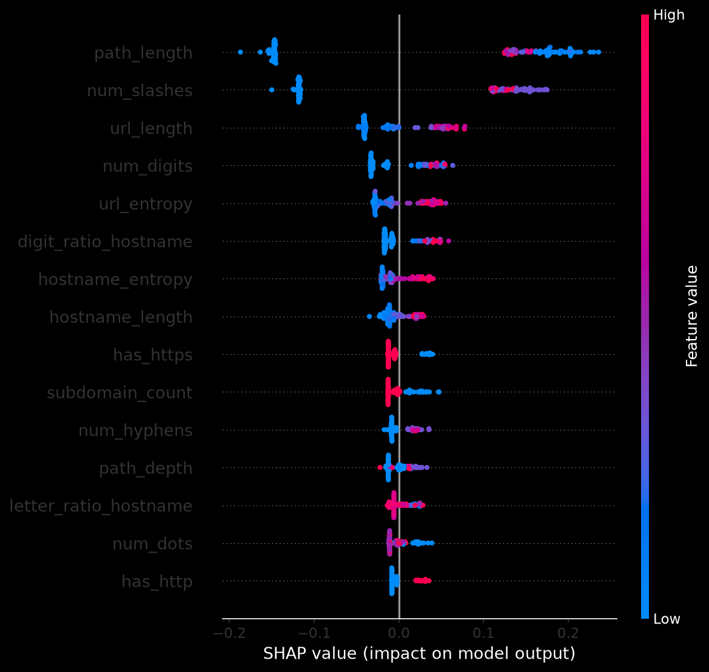
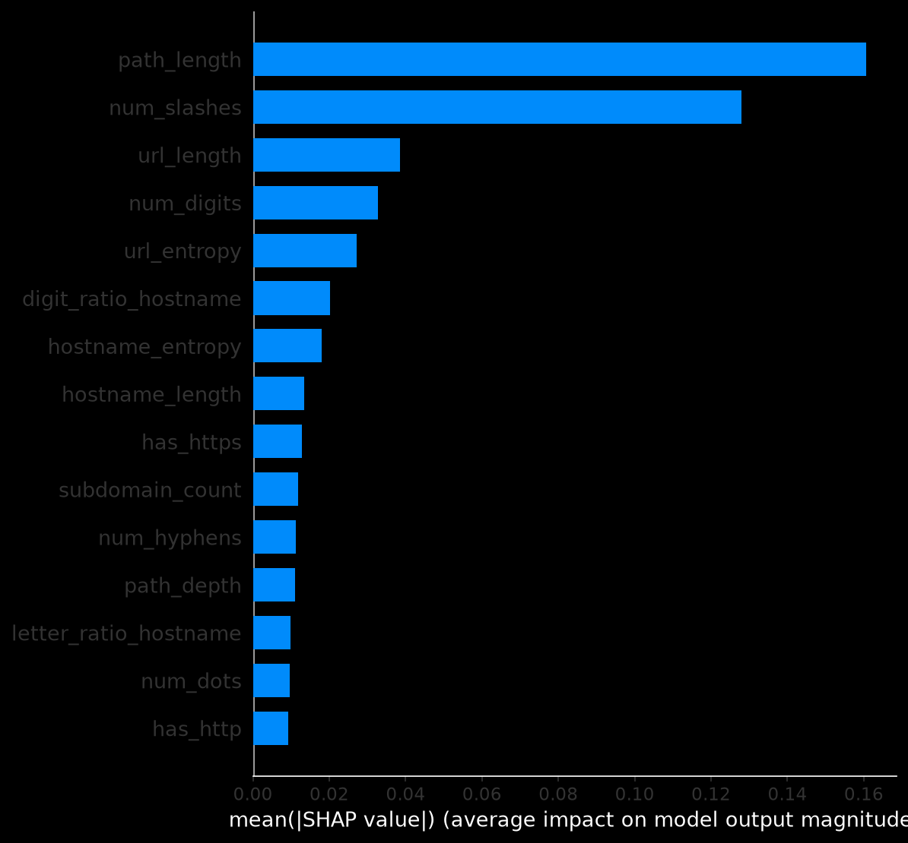

# Appendix A - PhishLens Prototype and Explainability Evidence

[PUT YOUR ACTUAL SCREENSHOT OF THE PHISHLENS INPUT SCREEN HERE]

---

## Figure A1: PhishLens URL Input Interface

[PUT YOUR ACTUAL SCREENSHOT SHOWING A PHISHING/LEGITIMATE PREDICTION HERE]

---

## Figure A2: Example PhishLens Classification Output

[PUT YOUR ACTUAL SCREENSHOT SHOWING THE SHAP EXPLANATION HERE]

---

## Figure A3: Example SHAP Feature-Level Explanation

The repository already contains SHAP feature-level visual outputs. You can use one of these directly:

### Option 1 - SHAP Summary Plot

### Option 2 - SHAP Importance Bar Plot

