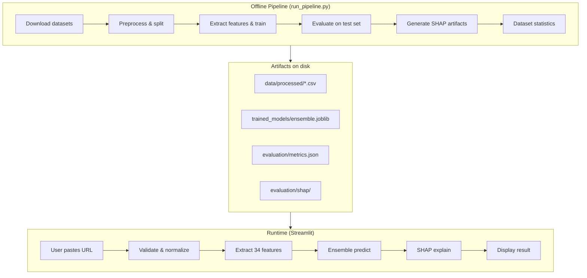

# PhishLens — Project Report

**Explainable Ensemble Machine Learning for Phishing URL Detection**

| Field | Value |
|-------|-------|
| Project | PhishLens |
| Type | Master's dissertation research prototype |
| Stack | Python, scikit-learn, SHAP, Streamlit |
| Model version | 1.0.0 |
| Last trained | 2026-07-04 (UTC) |
| Report generated | 2026-07-04 |

---

## 1. Executive Summary

PhishLens is a local machine learning system that classifies URLs as **phishing** or **legitimate** using only the URL string itself — no browser visit, no page content, no malware scanning. A soft-voting **ensemble** of three complementary classifiers produces a probability score and risk level. **SHAP** (SHapley Additive exPlanations) explains which URL features drove each prediction.

The primary deliverable is a **Streamlit dashboard** where users paste a URL and receive a classification, confidence score, risk band, and human-readable explanation. An offline pipeline (`scripts/run_pipeline.py`) handles data download, preprocessing, training, evaluation, and SHAP artifact generation.

**Research question:**

> Can an Explainable Ensemble Machine Learning model improve phishing URL detection while providing transparent explanations through SHAP?

---

## 2. Problem Statement

Phishing attacks often rely on deceptive URLs — typosquatting, brand impersonation, suspicious paths, and obfuscated hosts. Security tools that only block known bad links miss novel campaigns. PhishLens addresses this by learning patterns from labelled URL examples and explaining its reasoning, supporting both automated detection and user trust.

### Scope

| In scope | Out of scope |
|----------|--------------|
| Lexical and host-based URL features | Visiting or rendering web pages |
| Ensemble classification + SHAP | Network traffic or email header analysis |
| Local Streamlit dashboard | Real-time threat-intel API integration |
| Reproducible offline training pipeline | Production deployment / blocking at scale |

---

## 3. System Architecture

PhishLens operates in two modes:

1. **Offline pipeline** — build and evaluate the model from datasets.
2. **Interactive dashboard** — classify new URLs using the saved model.

For Colab-based model development, a reproducible notebook workflow is provided in
`notebooks/phishlens_colab.ipynb`.



### Project layout

```
phishlens/
├── scripts/run_pipeline.py      # End-to-end ML pipeline entry point
├── training/                    # Download, preprocess, train, evaluate, SHAP
├── streamlit_app/               # Dashboard (dissertation artefact)
│   ├── app.py                   # Landing page
│   ├── pages/                   # Dashboard, URL Analysis, Explainability, etc.
│   ├── services/                # Model loading, prediction, SHAP
│   └── utils/                   # Feature extraction, URL validation
├── data/                        # Raw and processed datasets
├── trained_models/              # Serialized ensemble + metadata
├── evaluation/                  # Metrics, plots, SHAP JSON
├── tests/                       # Unit tests
└── src/                         # React UI (design reference only, mock data)
```

---

## 4. Data Pipeline

### 4.1 Sources

Configured in `training/config.py` and documented in `data/DATASET.md`:

| Source | URL / feed | Label | Role |
|--------|------------|-------|------|
| **OpenPhish** | `https://openphish.com/feed.txt` | Phishing (1) | Live phishing URL feed |
| **PhiUSIIL** | GitHub mirror (academic dataset) | Mixed | Additional labelled URLs |
| **Benign list** | GitHub mirror | Legitimate (0) | Curated legitimate domains |

If remote downloads fail, the pipeline falls back to a built-in curated benign URL list (`training/download_data.py`) or a minimal seed dataset when all sources fail.

### 4.2 Current dataset snapshot

From the most recent pipeline run (`data/processed/dataset_stats.json`):

| Metric | Value |
|--------|-------|
| Total URLs | 518 |
| Phishing | 300 |
| Legitimate | 218 |
| Train / Val / Test | 310 / 104 / 104 |
| Sources active | OpenPhish (300), BenignList fallback (218) |
| Split ratio | 60% / 20% / 20% |
| Random state | 42 |

**Note:** PhiUSIIL and the external benign CSV mirror returned HTTP 404 during download. The model was trained on a smaller corpus than intended. Restoring those URLs (or integrating an alternative mirror) would improve coverage and generalisation.

### 4.3 Preprocessing steps

1. **Download** — fetch feeds, normalize to `url`, `label`, `source` columns.
2. **Merge** — concatenate all sources into `data/raw/merged_raw.csv`.
3. **Clean** — strip whitespace, drop short/invalid URLs, deduplicate by URL string.
4. **Stratified split** — preserve class balance across train, validation, and test sets.

Output files: `data/processed/{train,val,test,full}.csv`.

---

## 5. Feature Engineering

Features are extracted in `streamlit_app/utils/feature_extraction.py` — the same code path is used for **training** and **inference**, preventing train/serve skew.

**34 lexical and host-based features** per URL, including:

- **Length** — URL, hostname, path, query
- **Character counts** — dots, hyphens, digits, special characters
- **Structure** — subdomain count, path depth, query parameters
- **Security signals** — HTTPS/HTTP, `@` symbol, IP-as-host, port, double-slash redirect
- **Heuristics** — suspicious keywords (`login`, `paypal`, `verify`, …), suspicious TLDs (`.xyz`, `.tk`, …)
- **Entropy** — hostname, path, full URL
- **Brand impersonation** — heuristic score for known brand typosquatting

No label information is used during feature extraction (no data leakage).

---

## 6. Machine Learning Model

### 6.1 Ensemble design

A **soft-voting `VotingClassifier`** combines three base learners (`training/train.py`):

| Base learner | Key settings |
|--------------|--------------|
| Logistic Regression | Standardized features, class-balanced training |
| Random Forest | 200 trees, max depth 20, balanced classes |
| Support Vector Machine (RBF) | Standardized features, probabilistic output enabled |

Each model outputs class probabilities; the ensemble averages them for the final phishing probability.

### 6.2 Validation performance (base learners)

| Model | Validation F1 |
|-------|---------------|
| Logistic Regression | 0.912 |
| Random Forest | 0.984 |
| Support Vector Machine (RBF) | 0.959 |
| **Ensemble** | **0.959** |

### 6.3 Risk thresholds

Phishing probability maps to risk bands (`training/config.py`):

| Risk level | Probability range |
|------------|-------------------|
| Low | 0.00 – 0.30 |
| Medium | 0.30 – 0.60 |
| High | 0.60 – 0.85 |
| Critical | 0.85 – 1.01 |

---

## 7. Evaluation Results

Metrics computed on the **held-out test set** (104 URLs never seen during training). Source: `evaluation/metrics.json`.

### 7.1 Test set metrics

| Metric | Value |
|--------|-------|
| Accuracy | 100.00% |
| Precision (phishing) | 100.00% |
| Recall (phishing) | 100.00% |
| F1 (phishing) | 1.000 |
| ROC-AUC | 1.000 |
| Average precision | 1.000 |

### 7.2 Confusion matrix (test set)

|  | Predicted Legitimate | Predicted Phishing |
|--|---------------------|-------------------|
| **Actual Legitimate** | 44 | 0 |
| **Actual Phishing** | 2 | 58 |

No false negatives or false positives were observed on this test split.

### 7.3 Per-model comparison (test set)

| Model | Accuracy | F1 |
|-------|----------|-----|
| Logistic Regression | 95.19% | 0.957 |
| Random Forest | 100.0% | 1.000 |
| Support Vector Machine (RBF) | 98.08% | 0.983 |
| **Ensemble** | **100.0%** | **1.000** |

### 7.4 Inference latency

Measured on a 100-URL sample from the test set:

| Statistic | Latency |
|-----------|---------|
| Mean | 64 ms |
| Median (p50) | 62 ms |
| p95 | 77 ms |

### 7.5 Caveats

High test metrics on a **small** (104-sample) test set with limited source diversity should be interpreted cautiously. Performance may drop on URLs from unseen campaigns, TLDs, or URL shorteners. External validation on larger public datasets (e.g. PhiUSIIL, UCI phishing features) is recommended before any production use.

---

## 8. Explainability (SHAP)

PhishLens uses SHAP `TreeExplainer` with a Random Forest proxy from the voting ensemble to answer: *"Which features pushed this URL toward phishing or legitimate?"*

### Global explanations

- Summary and importance plots saved under `evaluation/shap/` and `evaluation/plots/`.
- Global feature importance JSON: `evaluation/shap/global_importance.json`.

### Local explanations (per URL)

At inference time (`streamlit_app/services/explainer.py`):

1. Compute SHAP values for the URL's feature vector.
2. Rank top positive and negative contributors.
3. Generate a plain-language narrative (e.g. high `suspicious_keyword_count`, `has_ip_host`).

This supports the dissertation goal of **transparent, interpretable** detection rather than a black-box score alone.

---

## 9. Streamlit Dashboard

**Launch:** `streamlit run streamlit_app/app.py`

| Page | Purpose |
|------|---------|
| Landing | Project overview and quick metrics |
| Dashboard | Summary statistics and navigation |
| URL Analysis | Paste a URL → classification, risk, model votes |
| Explainability | SHAP plots and per-URL narratives |
| Model Evaluation | Test metrics, confusion matrix, ROC curves |
| Dataset Analytics | Class balance, source breakdown |
| Research | Methodology and research framing |
| Confidence Evidence | Pre/post SHAP confidence capture and uplift summary |

### Prediction flow (runtime)

```
User URL
  → validate_url()           # syntax check, normalization
  → extract_features_dataframe()  # 34 numeric features
  → ensemble.predict_proba()   # phishing probability
  → risk level mapping
  → optional SHAP explanation
  → display in UI
```

The dashboard requires a trained model at `trained_models/ensemble.joblib`. If missing, the UI prompts to run `python scripts/run_pipeline.py`.

Confidence evidence records are stored in `evaluation/user_confidence.json` and can be used in dissertation analysis to quantify confidence uplift after explanations.

---

## 10. How to Reproduce

### Prerequisites

```bash
python -m venv .venv
.venv\Scripts\activate        # Windows
pip install -r requirements.txt
```

### Full pipeline

```bash
python scripts/run_pipeline.py
```

Steps executed: download → preprocess → train → evaluate → SHAP → dataset stats.

### Dashboard

```bash
streamlit run streamlit_app/app.py
```

### Tests

```bash
pytest tests/ -v
```

---

## 11. Limitations and Future Work

### Limitations

- **URL-only analysis** — cannot detect phishing on benign-looking URLs that serve malicious content only after page load.
- **Dataset size** — current run uses 518 URLs; two configured mirrors failed (404).
- **Feature overlap** — lexical features may not generalise to novel obfuscation (homoglyphs, heavy encoding).
- **No live updating** — OpenPhish feed is fetched at pipeline time, not continuously in the dashboard.
- **Local prototype** — not hardened for production security, rate limiting, or adversarial robustness.

### Recommended improvements

1. Fix or replace broken dataset URLs in `training/config.py` (PhiUSIIL, benign mirror).
2. Integrate alternative public datasets (e.g. feature-rich CSV mirrors with adapter code).
3. Expand benign URL diversity beyond the curated fallback list.
4. Cross-validate on external benchmarks not used in training.
5. Add periodic retraining workflow for fresh OpenPhish samples.

---

## 12. Academic Integrity

All metrics, plots, and SHAP values displayed in the Streamlit app are computed from **real model outputs** on the processed dataset splits. No fabricated evaluation results. See `data/DATASET.md` for full preprocessing and split methodology.

The `src/` React application is a **design reference only** (mock data) and is not the dissertation artefact.

---

## 13. References and Documentation

| Document | Location |
|----------|----------|
| Quick start | `README.md` |
| Dataset methodology | `data/DATASET.md` |
| Configuration | `training/config.py` |
| Test metrics | `evaluation/metrics.json` |
| Model metadata | `trained_models/metadata.json` |
| Dataset statistics | `data/processed/dataset_stats.json` |

---

## 14. Glossary

| Term | Meaning |
|------|---------|
| **Phishing** | Fraudulent attempt to obtain credentials or data via deceptive links |
| **Ensemble** | Multiple models combined; here, soft voting over probabilities |
| **SHAP** | Game-theory based method to explain each feature's contribution to a prediction |
| **Stratified split** | Train/val/test split that preserves the ratio of phishing vs legitimate |
| **Lexical features** | Properties derived from the URL text, not from page content |
| **OpenPhish** | Public feed of known phishing URLs |
| **PhiUSIIL** | Academic phishing URL dataset (mirror used when available) |

---

*End of report.*
